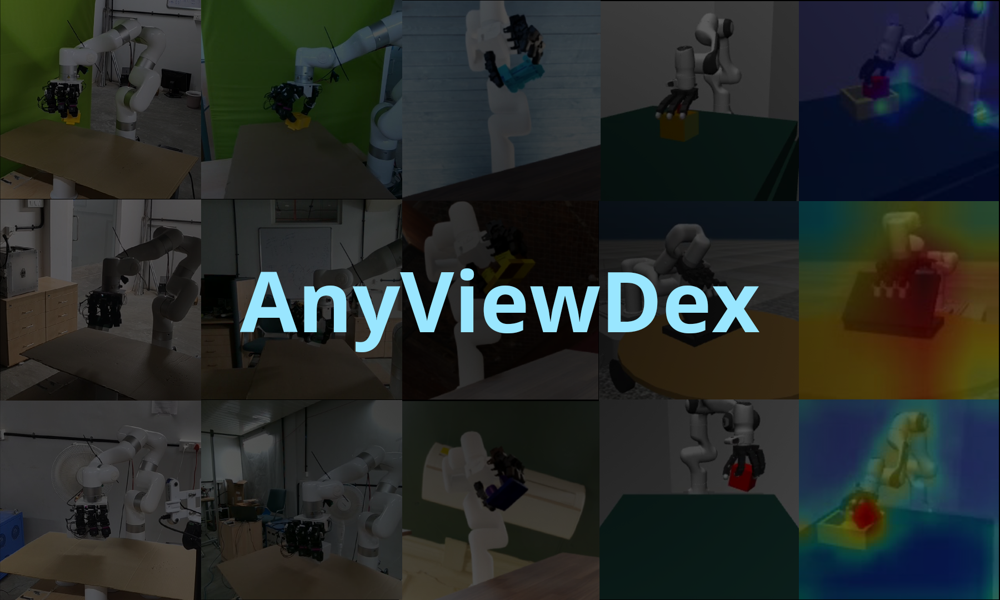

# AnyViewDex: View-Invariant Dexterous Manipulation from RGB Observations

  

 

  <strong><a href="https://anyviewdex.github.io/">🌐 Project Website</a></strong>

 

## Abstract
Visuomotor policies for multi-fingered dexterous manipulation are notoriously sensitive to camera viewpoint shifts, typically requiring rigid, laboratory-grade calibration for successful deployment. Conventional strategies for achieving viewpoint robustness typically rely on either explicit 3D sensing, which introduces complex hardware dependencies, or exhaustive data collection from varied perspectives, which induces significant variance during policy optimization. We propose AnyViewDex, a joint representation learning framework that enables robust, view-invariant dexterous grasping using solely monocular RGB observations. To resolve the geometric ambiguities of 2D vision without relying on test-time depth sensors or prohibitively large multi-view datasets, AnyViewDex leverages an asymmetric training pipeline. We regularize a standard monocular backbone with auxiliary 3D geometric supervision derived entirely from privileged simulation data, anchoring the visual representation in the physical workspace. This strategy enables the network to implicitly infer the 3D spatial relationships required for dexterity from uncalibrated 2D projections. We evaluate our framework across reinforcement learning and student-teacher distillation paradigms, consistently matching the performance of depth-reliant methods. Finally, we demonstrate zero-shot sim-to-real transfer on a physical xArm7 equipped with a 16-DoF LEAP Hand, achieving robust multi-object grasping under varying camera perturbations.